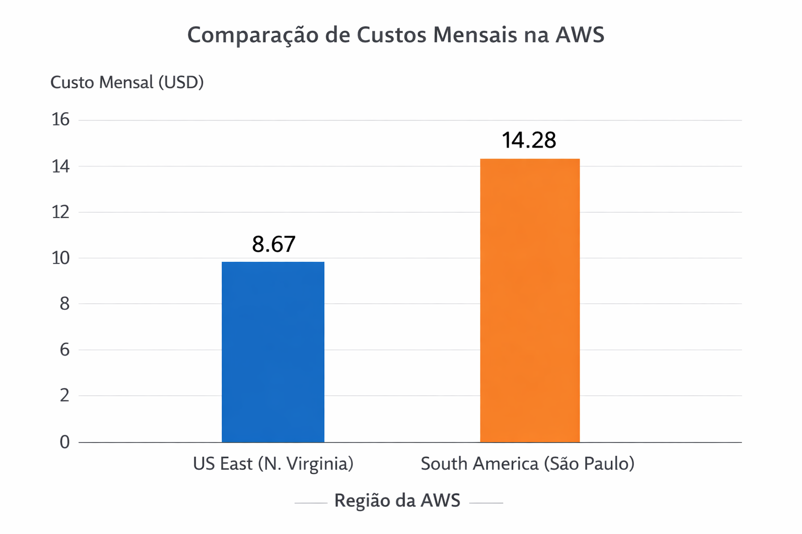
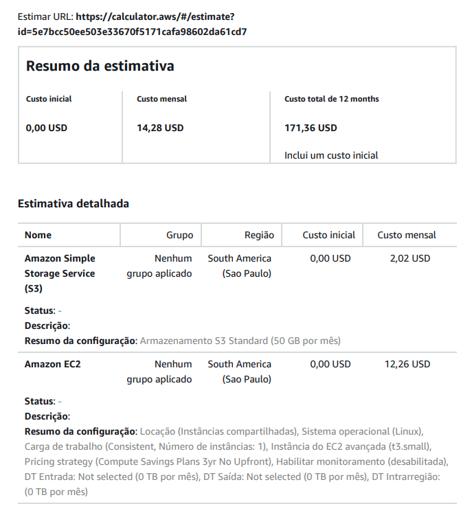
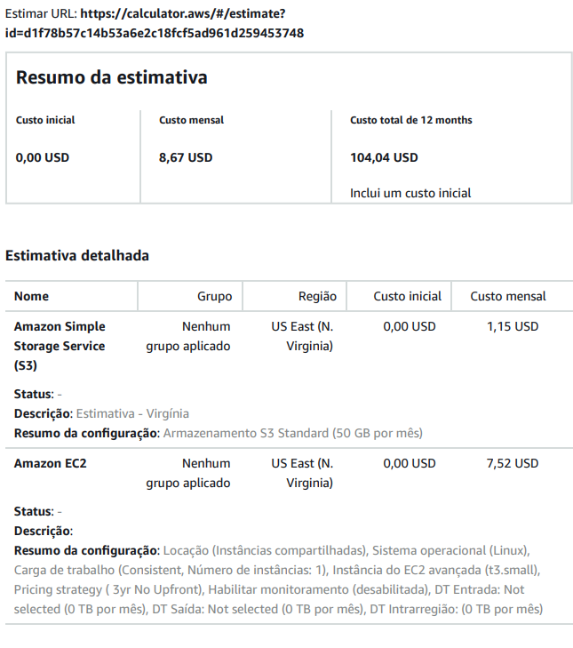

# FarmTech Solutions – Entrega 2: Estimativa de Custos na AWS

## Integrante
**Kláyver Loiola Lima**  
RM: 566837

---

# Vídeo Demonstrativo

Neste vídeo é apresentada a comparação de custos entre as regiões AWS São Paulo e Virgínia utilizando a AWS Pricing Calculator.

Assista ao vídeo:

https://youtu.be/6p1gXNiDM1I

# Objetivo

Esta entrega tem como objetivo estimar os custos de infraestrutura na AWS para hospedar uma API responsável por receber dados de sensores agrícolas e executar um modelo de Machine Learning desenvolvido na etapa anterior do projeto.

A análise compara os custos de hospedagem entre duas regiões da AWS:

- **US East (N. Virginia)**
- **South America (São Paulo)**

A estimativa foi realizada utilizando a **AWS Pricing Calculator**.

---

# Configuração da Máquina

A configuração considerada para a hospedagem da aplicação foi:

- Sistema operacional: **Linux**
- Instância EC2: **t3.small**
- **2 vCPUs**
- **Memória aproximada de 1 GiB** (instância disponível mais próxima na AWS)
- **Rede de até 5 Gigabit**
- **50 GB de armazenamento**

Essa configuração representa uma máquina simples capaz de hospedar uma API responsável por processar os dados recebidos dos sensores e executar o modelo de Machine Learning.

---

# Comparação de Custos

Foram realizadas estimativas de custo utilizando a AWS Pricing Calculator para as duas regiões analisadas.

| Região | Custo mensal |
|------|------|
| US East (N. Virginia) | **8.67 USD** |
| South America (São Paulo) | **14.28 USD** |

Observa-se que a região **US East (N. Virginia)** apresenta menor custo devido à maior escala de infraestrutura e maior número de data centers disponíveis nos Estados Unidos.

---

# Gráfico de Comparação

A figura abaixo apresenta uma comparação visual entre os custos estimados nas duas regiões.

---

# Estimativa – Região São Paulo

Custo mensal estimado: **14.28 USD**

---

# Estimativa – Região Virgínia

Custo mensal estimado: **8.67 USD**

---

# Justificativa da Escolha da Região

Apesar da região **US East (N. Virginia)** apresentar menor custo mensal, a região escolhida para este projeto seria **South America (São Paulo)**.

Essa escolha se justifica pelos seguintes fatores:

- menor latência para comunicação com sensores localizados no Brasil;
- maior velocidade de resposta da API;
- armazenamento de dados dentro do território nacional;
- conformidade com restrições legais relacionadas à transferência internacional de dados;
- adequação à **Lei Geral de Proteção de Dados (LGPD)**.

Dessa forma, mesmo com custo superior, a região de **São Paulo** oferece maior segurança jurídica e melhor desempenho para o cenário proposto.

---

# Ferramentas Utilizadas

- AWS Pricing Calculator
- Amazon EC2
- Amazon S3
- GitHub